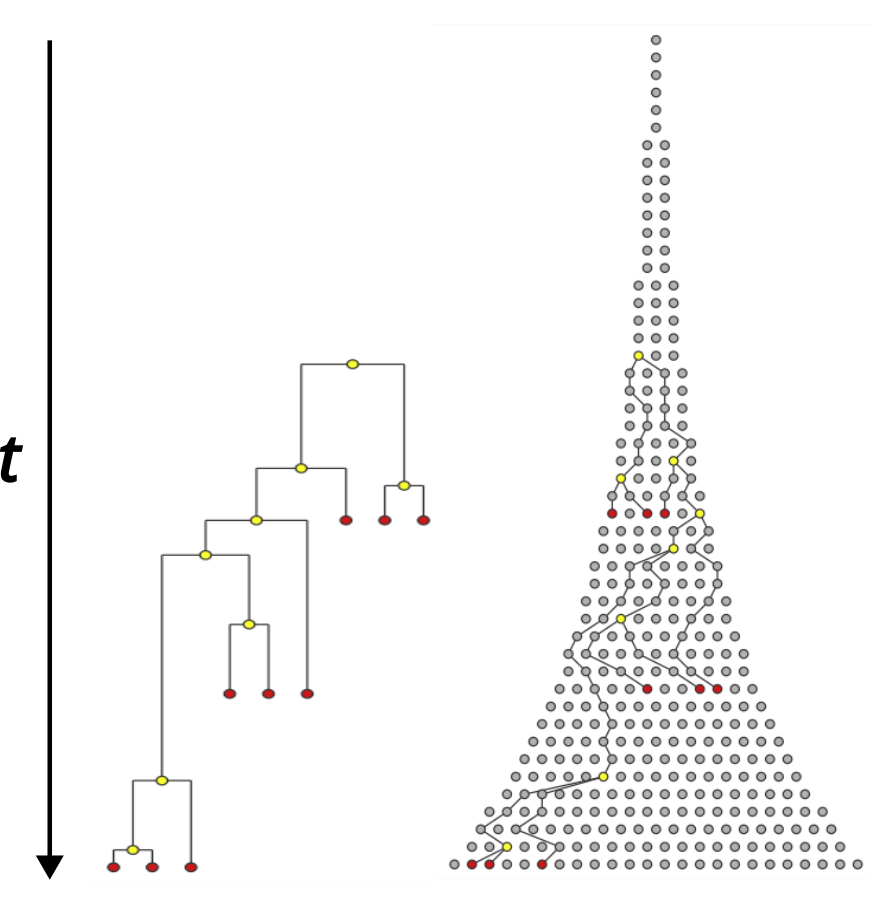
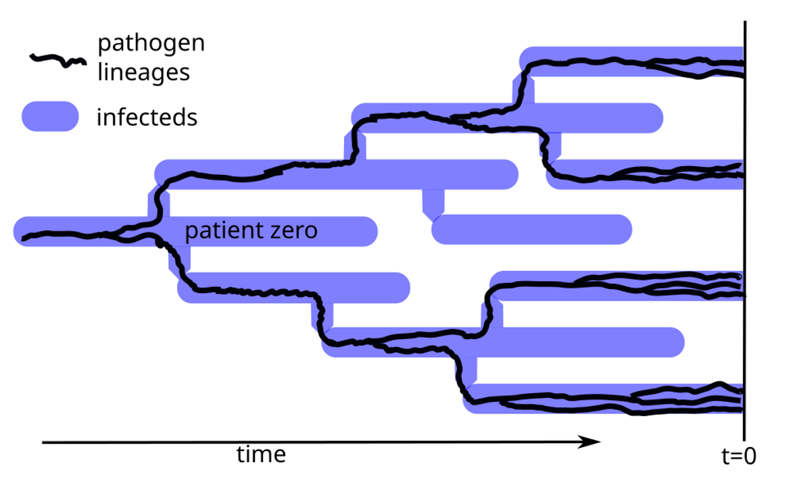
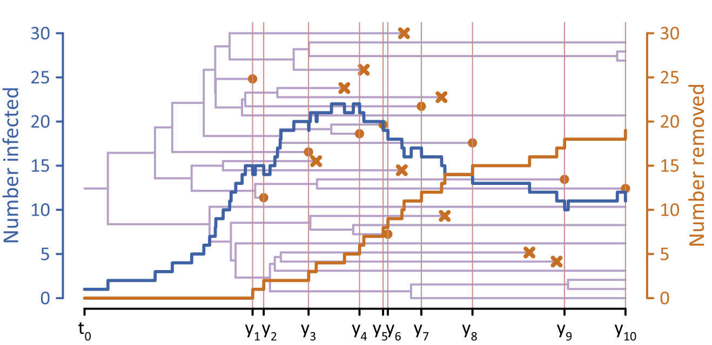
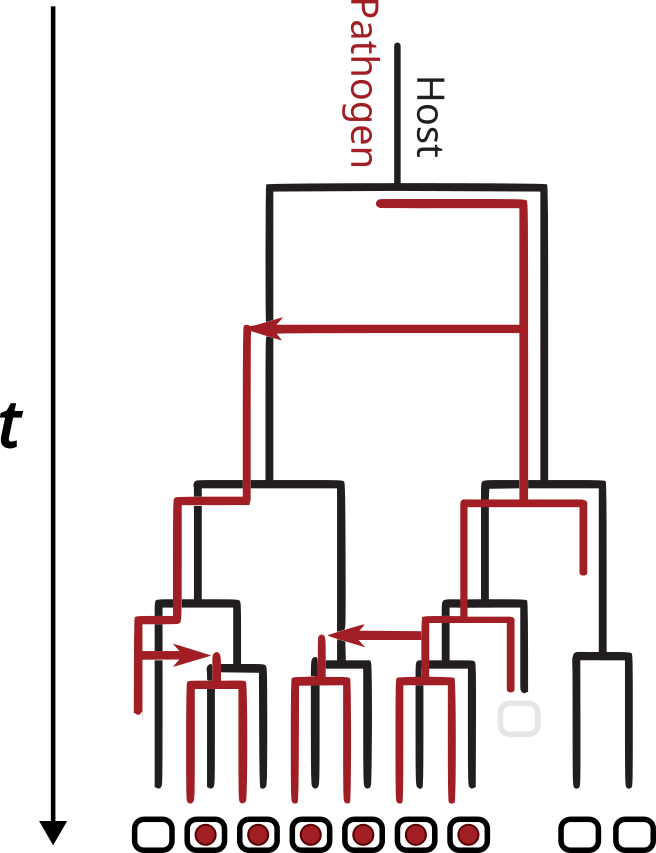
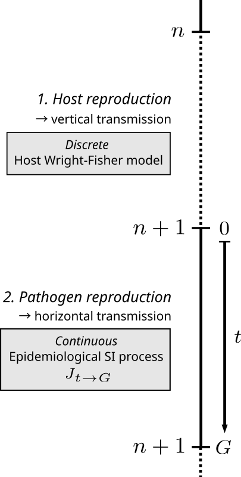
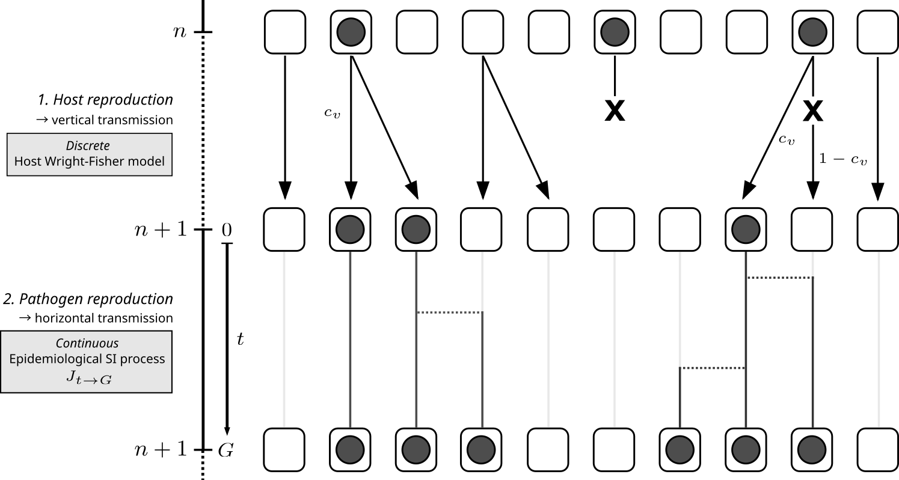

#+title:Pathogen dynamics nested in a host Wright-Fisher model: towards joint host-pathogen genealogies
#+subtitle: CoNeMEsSA Seminar
# #+author: Philip Wolper \inst{1} \and Johannes Müller \inst{2} \and Aurélien Tellier \inst{1}
#+startup: beamer
#+LaTeX_CLASS: beamer
#+BEAMER_THEME: Berlin
#+options: H:2 author:nil 
#+LATEX_HEADER: \addbibresource{~/org/biblio/pop-gen.bib}
#+LATEX_HEADER: \setbeamerfont{caption}{size=\scriptsize}
#+LATEX_HEADER: \author[]{Philip Wolper \inst{1} \and Johannes Müller \inst{2} \and Aurélien Tellier \inst{1}}
#+LATEX_HEADER: \institute[]{\inst{1} Section of Population genetics, Technical University of Munich \and \inst{2} Department of Mathematics, Technical University of Munich}

* Abstract :noexport:
Abstract:
Phylodynamics aims to infer epidemiological parameters from genetic sequences. Herein, the starting point is usually an ODE characterizing the infection dynamics. The coalescence of pathogens is then constructed based on the incidence as birth rate, and the prevalence as population size. Essentially, the evolution of the host is assumed to be on a slow time scale, such that the coalescence of hosts and pathogens decouple, and host evolution is neglegible from a phylodynamics perspective. When observing host-pathogen interactions from a coevolutionary perspective pathogen genealogies rather are embedded within a host genealogy, mediated through horizontal and vertical transmission. 

We aim to discuss first ideas how to understand the combined coalescence of pathogens and hosts, starting from a semi-discrete model that combines Wright-Fisher (WF) generations with a susceptible-infected (SI) transmission model. A main characteristic of this model is that host generations are non-overlapping, a central assumption of common population genetic models (such as the WF), that is valid for many seasonal plants or insects. Within each generation, we consider an SI-type infection process. 

It turns out that the coalescence probability of pathogenes consists of two components: (i) The coalescence probability within one host generation, as a consequence of the SI dynamics, which can be analyzed using Polya urns. (ii) The second component stems from vertical transmission during the coalescence of hosts and is given by the seminal Kingman coalescent. We show that it is possible to infer parameters of the infection model based on both, the genetic data of pathogens as well as the that of hosts. Finally we wish to discuss how this model provides a basis for studying more complex host-pathogen coevolutionary models in the context of joint host-pathogen coalescent trees.

* Introduction :noexport:
Phylodynamic inference of disease dyamics relies on connecting epidemiological dynamical models to a coalescent model of a sample of genetic sequences, often done heuristically. In order for the pathogen tree to relate to the host-measured SI process this typically employes several assumptions: (i) host evolution occurs on a much slower time scale (i.e. is neglegible) than the epidemic and (ii) each host is only infected with one pathogen individual. If these are given then we can construct the pathogen coalescent from $N_{\text{pathogen}} \sim I$.
 
In real world host-pathogen systems though these assumptions can often be violated due to reciprocal host-pathogen interactions, complex disease-life cycles, including varying transmission modes, vectors and environmental factors. Importantly, evolutionary time scales of host and pathogens likely play a role in all but the most explosive epidemics.
Many diseases have the ability to pass from infected to offspring through vertical transmission, in addition to horizontal epidemic infection dynamics. As infected hosts act as vessels for pathogens, it follows that the pathogen coalescent trees are embedded into a host genealogy, determined through vertical and horizontal transmission dynamics. The behaviour of joint host-pathogen genealogical processes is not well understood, as to our knowledge there is no generalized coalescent model based on the reproductive processes of hosts and pathogens, and the infection process that connects them ([[cite:&ebert-2020-host]]).

* Presentation, CoNeMEsSA Sep. '26
** Phylodynamics: Inferring epidemiological parameters from pathogen genetic sequences. 
*** :BMCOL:
:PROPERTIES:
:BEAMER_col: 0.5
:END:
- Pathogens coalesce backwards in time with the transmission tree of infected individuals.
- We can derive the coalescent rates from an epidemiological model (incidence and prevalence), and compare to observed pathogen sequence trees.
  
*** :BMCOL:
:PROPERTIES:
:BEAMER_col: 0.5
:END:
#+attr_latex: :width 0.8\textwidth
#+caption: Infectious branching process from [[cite:&kuehnert-2011-phylog-epidem]].

** Phylodynamics: Basics of pathogen coalescence
*** Pathogen coalescence tree :BMCOL:
:PROPERTIES:
:BEAMER_col: 0.45
:END:
#+attr_latex: :width \textwidth
#+caption: Pathogen coalescent within transmission tree (J. Müller, 2026)

\vspace{25pt}

*** Coalescence in epidemic dynamics :BMCOL:
:PROPERTIES:
:BEAMER_col: 0.55
:END:
\vspace{45pt}
#+attr_latex: :width \textwidth
#+caption: Coalescent process within the epidemiological dynamics of $I$ (Fig. 1D, [[cite:&plessis-2015-gettin-to]])

** Phylodynamics: Assumptions
***  Assumptions :B_block:
:PROPERTIES:
:BEAMER_env: block 
:END:
1. Host coalescence is neglegible compared to pathogen coalescent times.
2. Pathogen coalescent tree reflects the transmission tree.
3. Each host is infected by a single pathogen, so $I \sim N_{\text{Pathogen}}$
4. Evolution is measurable, i.e mutations occur on the timescale of transmission.
*** 
    :PROPERTIES:
    :BEAMER_env: ignoreheading
    :END:   
\vspace{5pt}
\textbf{Real-world host-pathogen systems:}\\
- complex disease life-cycles including /varying transmission modes/, vectors and environmental factors
- reciprocal host-pathogen interactions (/coevolution/)
# \vspace{5pt}
# Importantly, evolutionary time scales of host and pathogens likely play a role in all but the most explosive epidemics.

* Joint Host-Pathogen Genealogies
** TODO Joint Host and Pathogen Genealogies
*** :BMCOL:
:PROPERTIES:
:BEAMER_col: 0.6
:END:
Applying phylodynamics to diseases beyond epidemic growth, requires consideration of host coalescence, i.e. \textbf{no} time scale separation of host and pathogen coalescence:\\

\vspace{30pt}

\textbf{The pathogen genealogical process is embedded within the host genealogy, mediated by horizontal and vertical transmission}\\

*** :BMCOL:
:PROPERTIES:
:BEAMER_col: 0.45
:END:
#+attr_latex: :width \textwidth
# #+caption: Pathogen coalescent tree is embedded into host coalescent, adapted from [[cite:&vienne-2013-cospec-vs]] 

** TODO Vertical and horizontal transmission
# Expand on examples of vertical and horizontal transmission.
*** Transmission types :B_exampleblock:BMCOL:
:PROPERTIES:
:BEAMER_env: exampleblock
:BEAMER_col: 0.6
:END:
/\textbf{horizontal:}/ \\
Infection dynamics driven by host-to-host transmission. eg. SI, epidemiological models.\\
\vspace{10pt}
/\textbf{vertical:}/ \\
Pathogen can be transmitted from infected hosts to their offspring \\
\vspace{5pt}
(eg. HIV, Hepatitis B/C, Zika, Toxoplasmosis, ...)

*** :BMCOL:
:PROPERTIES:
:BEAMER_col: 0.45
:END:
#+attr_latex: :width \textwidth
# #+caption: Pathogen coalescent tree is embedded into host coalescent, adapted from [[cite:&vienne-2013-cospec-vs]] 

** Existing work
- [[cite:&lipsitch-1995-popul-dynam]]: Epidemiological dynamics of vertical and horizontal transmission (but no coalescence...)

\vspace{10pt}

- [[cite:&welch-2005-integ-geneal-epidem]]: Ancestral Infection and Selection Graph models joint host and pathogen genealogies within a Moran model framework. 

** Our approach 
- Joint host and pathogen model with intertwined host and pathogen coalescence
- Non-overlapping host generations (Wright-Fisher model)
- Vertical pathogen transmission from one generation to the next
- Epidemiological dynamics (SI model) within one host generation

* Nested Host and Pathogen model
** TODO Semi-discrete nested Host-Pathogen model
# Insert time axis of semi disrete model to begin with model.
#+attr_latex: :width 0.3\textwidth

** TODO Semi-discrete nested Host-Pathogen model
#+attr_latex: :width 1.2\textwidth
# #+caption: Semi-discrete neste Host-Pathogen model
 

** Bibliography
[[printbibliography:]]

