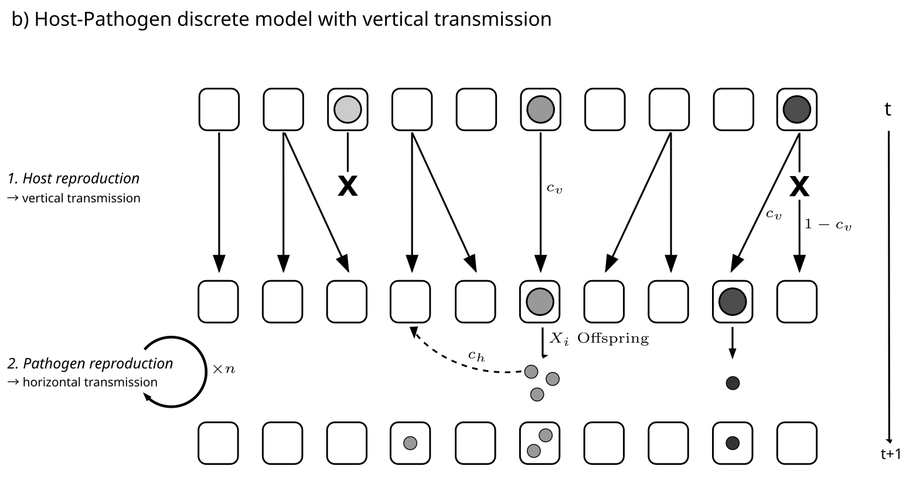

#+title: Mathematical models from epidemiology to coevolution
#+subtitle: Developing a genealogical model of host-pathogen coevolutionary epidemiology
#+setupfile: ~/.doom.d/setup-files/latex.setup
#+OPTIONS: toc:nil author:nil

#+LATEX_HEADER: \author[1]{Philip L. Wolper}
#+LATEX_HEADER: \affil[1]{Chair of Population Genetics, Technical University of Munich, Germany}

#+LATEX_HEADER: \addbibresource{~/biblio/pop-gen.bib}

* Existing coevolutionary models in discrete and continuous time
A major property of a host-pathogen model is the differences in time scale between the species. This reflects in the different analytical and modelling approaches we can take. Importantly, the choice of model depends on host-pathogen system under study. We aim to provide some recommendations and overview for which model type to use to describe the biological reality of host-pathogen interactions and life cycles we observe in nature? Beyond this we wish to connect some classically known coevolutionary models and population dynamics from host and pathogen epidemiology and ecology to models of genealogical branching and coalescence.  

** Continuous time-models
#+ATTR_LATEX: :options [enhanced, title={Continuous-time coevolutionary model based on differential equations}]
#+begin_tcolorbox
A well-known class of coevolutionary models is built on the works of [[cite:&anderson-1979-popul-biolog]] and epidemiological differential equations. The most simple case includes one host and one parasite, as described by the following model. $H$ represents the number of healthy individuals, while $I$ represents the infected indivudals in a population of $N = H+I$ hosts. 

\begin{equation}
\frac{dH}{dt} = bN - dH + \beta IH 
\end{equation}

\begin{equation}
\frac{dI}{dt} = \beta HI - dI - \delta I
\end{equation}

Here the birth rate at which all individuals reproduce (unaffected by infection) is $b$, and the natural death rate of healthy and infected is both $d$. Infected additionally die with disease indiced mortality rate $\delta$. The rate of transmission is $\beta$. 

Extensions of this model to include multiple pathogen stains can be found in [[cite:&may-1983-epidem-genet]] and subsequently with multiple host types in [[cite:&boots-2014-how-specif]], [[cite:&zivkovic-2019-neutr-genom]] and [[cite:&macpherson-2021-feedb-between]] (see epidemiological model therein). Other notable extensions in the aforementioned works include costs of infection and resistance and density-dependent population growth (?). Generally the model with multiple hosts of type $i$ and pathogens of type $j$ takes the form: 

\begin{equation}
\frac{dH_i}{dt} = b_{i}H_{i} - d_{i}H_{i} - \sum_{j=1}^{A_P}\sum_{k=1}^{A_H}\alpha_{ij}\beta_{ij}H_{i}I_{kj}
\end{equation}

\begin{equation}
\frac{dI_{ij}}{dt} = \alpha_{ij}\beta_{ij}H_{i}\sum_{k=1}^{A_H}I_{kj} - d_{ij} - \delta_{ij}
\end{equation}

Here $\alpha_{ij}$ represents the infection matrix determining the infection outcome. Host recovery as well as costs of infection, resistance and a reduction in fecundity when infected are omitted here for simplicity (see [[cite:&boots-2014-how-specif]], [[cite:&zivkovic-2019-neutr-genom]]).
#+end_tcolorbox

Additionally, continuous models of coevolution include models such as birth-death processes and Moran population models (eg. models from [[cite:&macpherson-2020-coevol-does]] and [[cite:&macpherson-2021-feedb-between]]) or the Moran Infection process used by [[cite:&welch-2005-integ-geneal-epidem]]. 

Other models aim to investigate the role of eco-evolutionary feedbacks, such as [[cite:&ashby-2019-under-role]]. (Large class of continuous models, eg. Nuismer book, that are not necessarily related to Anderson and May equations)?
*** Model examples :noexport:
Model follows from [[cite:&zivkovic-2019-neutr-genom]]. 
#+ATTR_LATEX: :options [enhanced, title={Continuous-time coevolutionary model based on epidemiological differential equations}]
#+begin_tcolorbox
Host-pathogen model from [[cite:&zivkovic-2019-neutr-genom]]. $H_i$ is the number of healthy hosts of genotype $i$, and $I_{ij}$ the number of hosts of genotype $i$, infected with pathogens of genotype $j$.
\begin{equation}
\frac{dH_i}{dt} = H_i \left[ b_i(1-c_{H_i}) - d_i - \sum_{j=1}^{A_P}\alpha_{ij}\beta_{ij}(1-c_{P_j}) \sum_{k=1}^{A_H}I_{kj} \right] + b_i(1-c_{H_i})\sum_{j=1}^{A_P}(1-s_{ij})I_{ij}
\end{equation}

\begin{equation}
\frac{dI_{ij}}{dt} = I_{ij}(-d_{ij} - \delta_{ij}) + H_i \left[ \alpha_{ij} \beta_{ij}(1-c_{P_j}) \sum_{k=1}^{A_H}\right]
\end{equation}

In this model, $b_i$ and $d_i$ are the birth and natural (disease-independent) death rates of host genotype $i$, respectively, with $\delta_{ij}$ being the disease induced death rate and $s_{ij}$ the reduction in fecundity in host $i$ infected with pathogen $j$. $\beta_{ij}$ is the disease transmission rate of a host $i$ infected with pathogen $j$ and $\alpha_{ij}$ is the infection matrix determining the disease outcome between host and pathogen genotypes $i$ and $j$. $c_{H_i}$ and $c_{P_j}$ and the costs of resistance and infectivity, respectively in the host and pathogen. The parameter $A$ gives the number of alleles (i.e. genotypes) of the host and pathogen (typically $A=2$). 

Similar models are given in [[cite:&may-1983-epidem-genet]], [[cite:&boots-2014-how-specif]] and [[cite:&macpherson-2021-feedb-between]] (see epidemiological model).  
#+end_tcolorbox

** TODO Discrete-time models
- evolutionary models rely on discrete models, that assume constant population size. Allele frequency dynamics is only by the frequencies of host and pathogen types (density independent?)[[cite:&tellier-2007-polym-multil]], [[cite:&tellier-2007-stabil-genet]]. Poly-cycllic or monocyclic diseases? 
  
** Semi-discrete
- combine both approaches with a semi-deterministic model? ([[cite:&mailleret-2009-note-semi]], [[cite:&hamelin-2011-season-evolut]]). Eg. seasonality.
* Existing approaches to host-parasite genealogical models
Linking epidemiological dynamic models with population genetic models and branching processes is essential to using genealogies because it requires consideration of the backwards model (i.e. coalescent model) with which the sample genealogies were constructed. Therefore it would be helpful to have a general coaescent model to describe these dynamics backwards in time or forward through simulation. IDEA: Can we do ARG inference for a sample genealogy from informed forward in-time simulations? 
** TODO Outline phylodynamics models
Eg. [[cite:&featherstone-2022-epidem-infer]] 
** TODO Sketch Welch et al., Ancestral infection and selection graph
  
* Two-species lineage-explicit conevolutionary models
To our knowledge most epidemiological and continuous coevolutionary models do not explicitly model both the pathogen and the host. Typically the population size of the pathogen is proxied with the number of infected hosts from the 'Infected' compartment of the epidemiological model. We believe, that the increased mathematical developments of non-standard coalescent models and genealogy-derived methods together with powerful population-genetic simulation toolkits capable of two Species individual-based model (eg. SLiM 5) will allow us to model the biological reality of host and pathogen system from the perspective of both hosts and pathogens.

The following sections describe different Two-species infection models in increasing complexity. We try highlight important characteristics and mechanisms of the models and how they might be related to other host-pathogen models, such as epidemiological models and coevolutionary models. 

** Moran Susceptible-Infected (Moran + SI)
We start with the Moran model, as this model most closely reflects rate-based birth death processes which approximate the differential equations of epidemiological dynamic models. This model is closely related to many SI-models, including [[cite:&welch-2005-integ-geneal-epidem]], which the only difference being, that we explicitly incorporate the pathogen as a species in SLiM, to enable parallel ancestry recording of the ARGs (tskit,  [[cite:&haller-2019-tree-recor]]).

Moran model of $N$ host individuals; each generation one host is randomly chosen to reproduce and one random host is replaced and dies. The probability to be the reproducing host depends on the health of the individual, so that the probability of a healthy individual to reproduce is scaled by $1+s_{I}$, with $s_{I}$ being the reproductive (fitness) advantage the healthy individuals have over infected ones. All hosts produce healthy offspring, i.e. there is no vertical transmission of pathogens in this model. If a killed individual is infected, the pathogen that infects this host is killed as well. 

The epidemiological dynamics of the pathogen popoulation is determined by a simple susceptible-infected (SI) model (similar to [[cite:&welch-2005-integ-geneal-epidem]]), starting with an initial infection in a random individual. Each generation, every infected host individual will infect another randomly chosen host with probability $c$, the contact rate, and if the target host is not yet infected the infection will be successful. For each successful infection the pathogen reproduces a clonal offspring, linked to the new host. Each host can only be infected by one pathogen individual simultaneously.
*What kind of model for the pathogen does this result in? Density-dependent growth?* The SLiM code for this model: [[./slim/TwoSpecies_Moran_SI.slim]]. A variation of this exists as a Susceptible-Infected-Susceptible model, where a host can overcome the infection at a give rate $\gamma$. In this case, the pathogen they contain is killed and the host returns to being healthy. Model: [[./slim/TwoSpecies_Moran_SIS.slim]] 

/Time scale of host and pathogens./ Importantly, the implementation of Moran Infection models has all pathogens can infect in each generation with probability $c$. This leads to a pathogen model with generation overlap, the pathogens killed can be from any generation. Adittionally, while the host follows a Moran model of one individual per generation ($d = 1/N$), the timescale at which the pathogens reproduce is much faster than that at which the host reproduces (biologically realistic anyway?). If we wanted a true Moran of hosts and pathogens it could be desirable to only let one random pathogen infect each generation. This would make the model very slow though, especially when studying coalescence (and the biological meaning is also not clear). To speed up the dynamics and study the coalescence of both hosts and pathogens, we implement the above mentioned model without generation overlap as a Cannings-type model. This results in a Moran-type host reproduction and a pathogen reproductive system described by a model of generation overlap ($d$ given by the probability $c$; [[cite:&alexandre-2025-bridg-wrigh]]). This causes the coalescence timescales to be the simiar, compared to the Moran-based host pathogen models described above.

** Wright-Fisher Susceptible-Infected (WF + SI)
/Vertical transmission mechanisms./ We might wish to write the model in terms of discrete, non-overlapping generations, as this is the basics of the Wright-Fisher  (WF) model and much of population genetics theory. For a two-species host-pathogen models this has the consequence of requiring vertical transmission: If host generations do not overlap in the Wright-Fisher model, there needs to be some kind of vertical transmission mechansism, or the pathogen will become extint within one generation. We distinguish between two types of of vertical transmission (i.e. mechanisms by which pathogens are transmitted between discrete (non-overlapping) generations of hosts);  /random/ vertical transmission, where pathogens infect randomly chosen host offspring and /ancestral/ vertical transmission, with host offspring being infected by their parents. Both types of vertial transmission have their biological justification; random vertical transmission might be common for dormant free-living pathogens and seasonal epidemics, while ancestral vertical transmission applies to the more classical mother-offspring vertical transmission known from clinical epidemiology. This distinction should be considered when designing a model of host-pathogen coevolution.

For a simple WF with host and pathognes we model random horizontal transmission of pathogens between host generations; no vertical transmission along lines of descent yet. Discrete generation stochastic model of Wright-Fisher host and pathogen reproduction. Each generation host produce offspring sampled randomly with replacement, which will make up the hosts in the new generation $t+1$, leading to a Wright-Fisher multipnomial reproduction mechanism (or other type of Canning's offspring distribution). The host parents are sampled weighted based on their infection status: If an individual is infected, its probability to be a parent is $1-s$, with $s$ being the cost of infection.  After host offspring are generated the pathogens each reproduce to a random unique (drawn without replacement) host offspring. This causes a reshuffling of the infected hosts each generation, due to each pathogen choosing a new host to infect. In addition to vertical transmission of pathogens between discrete host generations, each pathogen individual also can reproduce horizontally to a random host. If this host is not infected previously by vertical or horizontal tranmsiion events, then the horizontal transmitting pathogen will reproduce to the choosen host.   

** Generalized host-pathogen model with vertical and horizontal epidemiology

Aim to construct a nested Canning's model with host and $n \times$ pathogen reproduction steps (see Fig. [[generalized_vertical_model]]). *Add* host reproduction via some kind of Canning's or WF offspring process.
The model is in two phases: host reproduction and pathogen reproduction. Host reproduction proceeds by WF sampling and determines pathogen vertical transmission (each pathogen transmits vertically to the host offspring with probability $c_{v}$). If the host does not produce any offspring, the pathogen infecting it dies as well. Host reproduction is followed by pathogen reproduction (within the host), with each pathogen producing $X_{i}$ offspring, which can each migrate (horizontal infection) to another random host with probability $c_{h}$. 

#+name: generalized_vertical_model
#+caption: Two species, host-pathogen nested Canning's model with horizontal and vertical pathogen transmission. 
#+attr_latex: :width 1\linewidth  :center t :placement [h!]

\noindent *Limiting cases and Behaviours:*
We aim to develop a model that generalizes some of the behaviours and limiting cases above. such as scaling between continuous and discrete parts, and pathogen-host transmission system (eg. lineage-constrained transmission vs free transmission)...
- *$c_{v} = 1$, $X_{i} = 1$; $c_{h} = 1$:* discrete WF (pathogens find new random host each generation. Difference: pathogen population growth depends on host reproduction if pathogen vertically transmitted)
- *$c_{v} = 1$; $X_{i} = 1$; $c_{h} = 0$:* vertical WF (pathogens follow host lineages exactly. No horizontal transmission.)
- *$X_{i} \sim P(X \ge k)$; $c_{h} > 0$:* super-spreading, infection heterogeneity. Various pathogen offspring distributions.
- *$n >> 1$:* Polycyclic model. $n$ pathogen reproduction cycles per host reproduction. Seasonality? Epidemiological dynamics only (how to translate pathogen offspring and migration to SIR with superspreading model (eg. [[cite:&lloyd-smith-2005-super-effec]]).)

\noindent *Further questions and behaviours to consider:*
Further biological model features necessary genetics.
- Generation overlap? Overlapping generations, so vertical transmission can be $c_{v} = 0$.
- Multiple infections. Especially important in the regime $X_{i} > 1$. Also regarding whom to infect horizontally to. Single infections to healthy subclass keeps SI density dependent growth assumptions.  Intra-host selection or filter?
- Recombination between pathogen types. Within multiply infected hosts?  
- Host resistance and pathogen virulence types? Infection matrix for determining the outcome of the interaction. Mutation of types (reversible or uni-directional?) or standing genetic variation? 
  
* Notes on considerations for the two Species model :noexport:
- Stochastic individual-based implementation of co-evolutionary 'SIR' model ([[cite:&may-1983-epidem-genet]], [[cite:&boots-2014-how-specif]], [[cite:&zivkovic-2019-neutr-genom]]), with separated host, and parasite birth/death (coalescent) model.
- Variable population sizes to follow coevolutionary dynamics ([[cite:&zivkovic-2019-neutr-genom]]).
- Translating the deterministic host SI model of one coevolutionary "run" developed by [[cite:&zivkovic-2019-neutr-genom]] into a stochastic model of the host and pathogen lineages (both medium or long-term coevolution). How can the parameters of the model be incorporated in the SLiM forward in time model?
- Ensure model can form equilibrium as observed for SIR model classes or similar.
- how to handle fitness of infected vs. non-infected and resistant host types vs. susceptible host types.
- Modelling host and pathogen fitness. Selection on viability or mortality of host/pathogen? Host: infection, cost of resistance. Pathogen: infectivity, cost of infectivity.
- Pathogen genetic drift requires within-host pathogen reproduction or stochastic transmission modell

** Infection Matrix
- Infection matrix to incorporate the specific architecture of coevolutionary interaction. Multiple types of pathogen. Allow recombination between different types.

** Recombination in parasite
- see Lively, 2010 paper for a model of coevolution involving sex https://academic.oup.com/jeb/article-abstract/23/7/1490/7324449?redirectedFrom=fulltext

** SIR host model
- host classes and frequencies and determining reproductive process of hosts. (might not need for agricultural application, ABC).
- Differential reproduction of infected and non infected host classes (I and S,R?). Propagation of infection tags through the population, linking parasite individual to this host individual. Different parasite classes? Scale fitness of host by parasite virulence factor. Fitness in hosts? Tied to parasite trait? Add interaction matrices?
  
* Coalescence timescale of host-pathogen co-genealogies :noexport:
** Timescale in neutral host-pathogen models
Analysis of neutral co-branching model of host and parasites. Comparison of different timescales for Moran/WF, continuous/discrete. Framework and statistics for understanding linked trees.

#+name: discrete_WF_host_pathogen_tmrcas
#+caption: Host and pathogen TMRCAs for discrete WF SI Infection model. Starting from one initial infection in a coalesced host population, the pathogens are resampled randomly each discrete generation and transmit to an uninfected host individual horizontally with probability $c$. Host reproduce randomly (multinomial draw) with the probability that an infected host is chosen scaled by $1-s$, the cost of infection. Simulation with a haploid host population size $N=1000$. Host and pathogens reproduce clonally.  
#+attr_latex: :width 1\linewidth :center t 
[[./analysis/figures/discreteWF_HostvPathogenTMRCA_c\[0.01, 0.1, 0.5\]_s\[0.0, 0.01, 0.1, 0.5\]_reps50.png]]

*Hypothesis*: Ration of coalescence times between hosts and parasites depends on the transmission rate $c$ and the cost of infection in the host $s$.
* Further reading: Connecting coalescent models to epidemiology :noexport: 
** Random notes
- Offspring distributions from epidemiologcal models: negative binomial ([[cite:&lloyd-smith-2005-super-effec]]) with the parameters $R_{0}$ and $k$.
- [[cite:&li-2017-quant-trans]] show that the dispersion paramter of the epidemiological offspring distribution $k$ can be estimated from the pathogen phylogeny, using a formulation of of the Kingman coalescent with arbitrary offspring distributions ($N_{e} = N/\sigma^{2}$,[[cite:&koelle-2011-rates-coales]], [[cite:&fraser-2017-coales]]). How valid is this assumption for MMC?
- Multifurcating skyline plot [[cite:&hoscheit-2019-multif-skylin-plot]] uses Beta-coalescent to infer the effective population size through time, and show that the estimation of \alpha correlates with the degree of superspreading $k$ in an epidemiological model. What is the direct connection between \alpha and $k$?
- Special Issue: *Next-generation molecular and evolutionary epidemiology of infectious disease*.  https://royalsocietypublishing.org/toc/rstb/368/1614
- Pathogen genealogy inference framework from structured Markov processes (eg. SIR type stochastic models). Aaron King https://arxiv.org/abs/2405.17032#
- From simulations of SIR we can follow genealogy of host, or analytically for pathogen too it we know the AISG (?). Is this useful in downstream analysis (eg. tskit? adding contact arrows, etc.). Is the intrisic presence of the pathogen in the R status of the SIR model enough to work with the pathogen genealogy, or would a two species model be more practical?
- steady states of the SIR model might be reflected in heights of the coalescent trees pathogen/host? Metric from [[cite:&welch-2005-integ-geneal-epidem]]. Expected relative difference betwwen host and viral tree root age and Proportion in common between viral and host trees? Extend results of [[cite:&welch-2005-integ-geneal-epidem]] to resistant classes as well?
- e3SIM generate SLiM code from SIR models? Can we use our dynamic coevolution model for this?  https://jaeheekimlab.github.io/pdfs/papers/2024-xu-episim.pdf
** Co-phylogeny resources
Inspiration from co-phylogentic methods: \\
https://www.cell.com/action/showPdf?pii=S0169-5347%2806%2900378-8 \\
https://www.annualreviews.org/content/journals/10.1146/annurev-ecolsys-102320-112823 \\
https://academic.oup.com/cz/article/62/4/393/1745416?login=false \\
https://nph.onlinelibrary.wiley.com/doi/10.1111/nph.12150 \\
https://onlinelibrary.wiley.com/doi/full/10.1111/j.1420-9101.2007.01340.x \\
https://www.numericalecology.com/Reprints/ParaFit_paper.pdf \\
